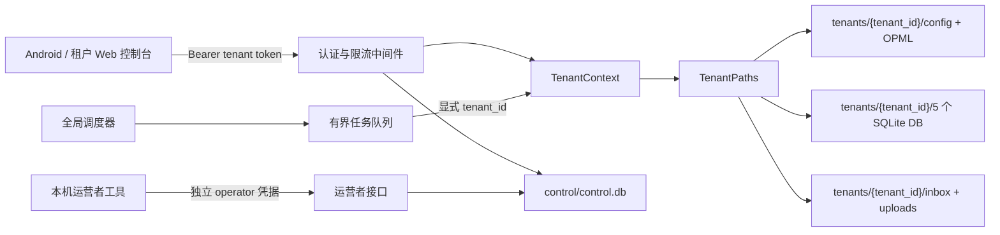

# RssAiPush PC 后端多租户服务器实施计划

> 编制日期：2026-07-03  
> 适用目录：`C:\Users\Harding\RssAiPush_Server`  
> 目标：在不影响现有自用版本的前提下，把该备份改造成可供多名用户通过同一域名使用、数据严格隔离、可管理和可回滚的 PC 服务器测试版本。

## 1. 结论

“每个用户一个独立数据目录和一组独立 SQLite 数据库、每个用户一个 token”是适合当前项目的方案。它能保留现有表结构和绝大多数业务 SQL，避免给每张表增加 `tenant_id`。

但原讨论稿低估了四项改造：

1. 租户路径不只出现在 5 个数据库连接函数中。当前代码还直接使用 `CONFIG_PATH`、`INBOX_DIR`、`INDEX_HTML`、5 个数据库路径、上传目录、分片目录和下载目录。仅 `INBOX_DIR` 在代码中就有数十处引用，因此必须建立统一的动态路径层并完成全量审计。
2. `ContextVar` 不会自动安全地解决所有后台线程问题。当前手动任务使用 `threading.Thread`，兴趣画像也有独立线程。新线程必须显式传递 `tenant_id`，或用复制后的上下文执行，否则可能读到空上下文或错误租户。
3. 当前 `/api/admin/*` 同时包含租户数据管理和服务器运维能力。普通租户不应获得日志、隧道、本机路径、进程或服务器配置权限，必须拆分“租户权限”和“运营者权限”。
4. Android 和 Web 管理端仍会把 token 放到 URL 查询参数中访问摘要页面。公网环境下 token 可能进入浏览器历史、代理日志或 Referer，因此前端需要小幅但必要的安全改造。

建议先做“受控邀请、少量用户、单机单进程”的试运行版本，不在第一版开放匿名注册、付费和无限并发。

## 2. 当前代码基线

检查结果：

- `RssAiPush_Server` 中的 `app.py`、`tasks.py`、`config.example.json`、`requirements.txt` 和 `start_server_pc.ps1` 与当前 `RssAiPush` 对应文件一致，适合作为隔离测试副本。
- 两个目录都没有 Git 元数据，当前无法可靠地查看变更、建立提交点或一键回退。
- 当前认证是单一全局 token；未配置 token 时所有受保护 API 会直接放行。
- `/healthz` 会返回安装目录、数据目录、数据库路径和下载目录等内部信息。
- 当前服务器由 Flask/Werkzeug 开发服务器启动。
- 调度器和任务运行状态是全局单例。
- 当前 PC 下载目录会被作为 PDF 扫描源。多租户环境下这会让租户任务接触服务器所有者的个人下载文件。
- Android 的普通 API 请求已支持 `Authorization: Bearer ...`，因此主要 API 基本不需要改调用方式。

## 3. 第一版明确决策

在编码前固定以下决策，避免实现中反复改变边界。

| 项目 | 第一版选择 | 原因 |
| --- | --- | --- |
| 开户方式 | 仅服务器所有者通过本机 CLI 邀请开户 | 避免公开注册、验证码、防滥用和计费系统同时进入首版 |
| 数据隔离 | 每租户一个目录，目录内 5 个 SQLite DB | 与现有结构最兼容，故障和备份边界清晰 |
| token | 每租户可有多个可撤销 token；只存哈希 | 支持手机更换、轮换、吊销，不保存可直接使用的明文 |
| 运营者认证 | 独立于租户 token 的 operator 凭据 | 普通租户不得控制隧道、服务器配置和日志 |
| AI 费用 | 首版优先 BYOK，即每租户提供自己的 AI Key | 避免服务器所有者承担不可控用量 |
| PDF 来源 | 普通租户只能处理自己上传的 PDF | 禁止扫描服务器所有者的全局 Downloads |
| 调度并发 | 有界线程池，初始最多 2 个租户任务并行 | 适合 PC 和 SQLite，避免 AI/API/磁盘瞬时过载 |
| 服务器进程 | 单进程 Waitress，多线程请求处理，单一调度器 | 避免多 worker 重复启动 APScheduler |
| 公网入口 | `127.0.0.1` 监听 + Cloudflare Named Tunnel | 不直接开放本机端口，使用稳定 HTTPS 域名 |
| 试运行规模 | 先 2 个测试租户，再逐步增至 5～10 个 | 先验证隔离、成本和资源占用 |

如果不采用 BYOK，必须在开放给其他用户前实现服务器总预算、租户日限额、并发限制和超限熔断；不能只做用量统计。

## 4. 目标架构



核心原则：

- `tenant_id` 只能由已验证 token 查出，不能信任 URL、请求体或客户端自报的租户 ID。
- 业务函数可以通过请求级 `TenantContext` 获取当前租户，但进入线程、调度器和队列时必须显式携带 `tenant_id`。
- 服务器级文件和租户级文件彻底分开。
- 未识别、过期、停用或撤销的 token 使用一致的失败响应，避免泄露租户是否存在。

## 5. 目标数据目录

运行数据不要放在代码目录内。建议测试数据根目录为：

```text
C:\Users\Harding\RssAiPushServerData\
├─ control\
│  ├─ control.db
│  └─ backups\
├─ global\
│  ├─ logs\
│  ├─ quick_tunnel.json
│  └─ tray_command.json
├─ tenants\
│  ├─ owner\
│  │  ├─ config.json
│  │  ├─ feedly.opml
│  │  ├─ rss_ai.db
│  │  ├─ pending_papers.db
│  │  ├─ pdf_seen.db
│  │  ├─ digest_messages.db
│  │  ├─ admin_state.db
│  │  ├─ inbox\
│  │  ├─ uploaded_pdfs\
│  │  └─ pdf_upload_chunks\
│  └─ <opaque-tenant-id>\
│     └─ ...
└─ backup_staging\
```

路径分类：

| 当前对象 | 改造后归属 |
| --- | --- |
| `CONFIG_PATH`、OPML | 租户 |
| `INBOX_DIR`、`INDEX_HTML` | 租户 |
| `RSS_DB`、`PENDING_DB`、`PDF_DB`、`DIGEST_DB`、`ADMIN_DB` | 租户 |
| `UPLOADED_PDF_DIR`、`PDF_CHUNK_DIR` | 租户 |
| `DOWNLOAD_DIRS` | 所有者租户可选；普通租户禁用 |
| `server.log` | 全局，仅运营者可见 |
| `QUICK_TUNNEL_STATE`、`TRAY_COMMAND_PATH`、`TRAY_CONFIG_PATH` | 全局，仅运营者可见 |
| token 映射、租户状态、配额、用量 | 全局 `control.db` |

所有路径拼接都要验证 `resolve()` 后仍位于预期租户目录下，并拒绝软链接、目录联接或重解析点造成的越界。

## 6. 控制库设计

新增全局 `control.db`，至少包含：

### 6.1 `tenants`

- `id`：不可猜测、不可修改的内部 ID。
- `display_name`：运营者可读名称，不参与路径拼接。
- `status`：`provisioning`、`active`、`suspended`、`deleted`。
- `created_at`、`updated_at`。
- `quota_json`：首版可存结构化配额，后续再拆表。
- `config_version`：用于默认配置升级。

### 6.2 `api_tokens`

- `id`：token key ID，用于快速定位记录。
- `tenant_id`。
- `token_prefix`：仅用于运营显示最后识别信息，不可用于认证。
- `token_hash`：高熵随机 token 的 SHA-256 或服务端 HMAC；比较使用 `hmac.compare_digest`。
- `scopes`：例如 `app`、`tenant_admin`。
- `created_at`、`last_used_at`、`expires_at`、`revoked_at`。

推荐 token 形式：

```text
rssai_tk_<token-id>_<32字节以上随机secret>
```

完整 token 只在创建时显示一次。日志、异常、数据库、管理页面和备份清单都不得保存完整 token。

### 6.3 `job_state`

- `tenant_id`、`job_type` 组成唯一键。
- `next_run_at`、`last_started_at`、`last_finished_at`。
- `status`、`last_error`、`lease_until`。

### 6.4 `usage_daily`

- `tenant_id`、`date`、`metric` 组成唯一键。
- 请求数、AI 调用数、估算 token 数、上传字节数、生成文件数。

此表即使 BYOK 也应保留，用于发现滥用和容量规划。

## 7. 权限边界

现有路由要先分类，再改认证，不能简单地让所有 token 继续访问所有 `/api/*`。

| 能力 | 未认证 | 租户 token | operator |
| --- | ---: | ---: | ---: |
| 精简 `/healthz` | 是 | 是 | 是 |
| 摘要、偏好、聊天、租户状态 | 否 | 当前租户 | 可诊断 |
| 租户 feed、租户 AI 配置、租户任务 | 否 | 当前租户 | 可代管 |
| 租户事件、队列、清理 | 否 | 当前租户管理员 | 可代管 |
| 服务器日志、本机路径、隧道、托盘设置 | 否 | 否 | 是 |
| 创建、停用租户，生成、吊销 token | 否 | 否 | 是 |

建议：

- 将服务器级能力迁移到 `/api/operator/*`。
- `/api/admin/*` 若保留名称，只表示“当前租户的管理能力”，不能再返回服务器级信息。
- `/api/logs` 改为 operator-only。
- `/healthz` 仅返回 `ok`、版本和基本状态；详细运行信息放到受保护的 operator 接口。
- 公网 API 只接受 `Authorization: Bearer`。停止接受长期 token 查询参数。

## 8. 分阶段实施步骤

### 阶段 0：建立可回滚基线

目标：任何后续阶段失败时，都能回到当前可运行版本。

操作：

1. 在 `C:\Users\Harding\RssAiPush_Server` 初始化独立 Git 仓库。
2. 检查 `.gitignore`，确保 `config.json`、数据库、日志、OPML、PDF、inbox、token、虚拟环境和构建产物不会提交。
3. 保存首个只包含源代码的基线提交。
4. 创建独立 Python 虚拟环境并锁定实际依赖版本；保留 `requirements.txt` 的直接依赖，同时生成可复现的锁定清单。
5. 在未修改代码前运行完整测试并记录结果、Python 版本和 Windows 版本。
6. 用当前单租户数据的副本进行测试，不直接使用正在运行的生产数据。

验收：

- `git status` 干净。
- 敏感数据不在 Git 索引内。
- 基线测试结果有记录。
- 可以从基线提交重新创建可运行目录。

回滚点：基线提交和原始数据只读备份。

### 阶段 1：引入全局设置、租户模型和目录模型

目标：先建立清晰的数据边界，不立即改业务行为。

建议新增模块：

- `server_config.py`：服务器级配置和全局路径。
- `tenancy/models.py`：租户、token 和配额模型。
- `tenancy/registry.py`：`control.db` 访问。
- `tenancy/context.py`：当前租户上下文。
- `tenancy/paths.py`：`TenantPaths` 数据类。
- `manage.py`：只在本机执行的运营 CLI。

操作：

1. 新增 `RSSAI_SERVER_DATA_DIR`，默认指向独立数据根目录。
2. `TenantPaths` 统一返回 config、OPML、5 个 DB、inbox、上传和分片路径。
3. 全局路径类只返回日志、隧道状态、托盘命令和 `control.db`。
4. 新建 `control.db` 的幂等迁移函数和 schema version。
5. 新建租户时先置为 `provisioning`，全部目录和数据库初始化成功后再切换为 `active`。
6. 禁止把 `display_name` 直接当目录名；目录只使用受约束的内部 ID。
7. 为 config 写入增加租户级锁、临时文件和 `os.replace`，避免写一半导致 JSON 损坏。

测试：

- 路径不能逃出 data root。
- 两个租户的每个目标路径都不同。
- 非法租户 ID、软链接和目录联接被拒绝。
- 重复初始化控制库不会破坏数据。
- 配置写入中断时旧文件仍完整。

验收：路径层和控制库测试通过，原业务尚可按 owner 租户兼容运行。

### 阶段 2：多 token 认证和请求上下文

目标：每个请求都能可靠映射到唯一租户，并在请求结束后清理上下文。

操作：

1. 用 `secrets.token_urlsafe` 生成高熵 token。
2. 只在 `control.db` 保存哈希、前缀、状态和时间，不保存完整 token。
3. Flask `before_request`：
   - 公共路由走严格白名单。
   - 读取并验证 Bearer token。
   - 查出 active tenant 和 scopes。
   - 设置 `TenantContext`。
4. Flask `teardown_request` 使用 `ContextVar.reset(token)` 清理上下文，防止线程复用时串租户。
5. 认证失败统一返回 401；权限不足返回 403；响应不透露租户是否存在。
6. `last_used_at` 采用节流更新，例如每个 token 最多 5 分钟写一次，避免每请求写控制库。
7. operator 凭据独立实现。首版建议来自 Windows 环境或受 ACL 保护的 secret 文件，并且 operator 页面仅允许本机访问。
8. 删除“未配置 token 即放行”的公网行为。开发模式若需要无认证，必须使用显式的 `RSSAI_INSECURE_DEV_MODE=1`，且只允许绑定 loopback。

测试：

- 缺 token、伪造 token、撤销 token、过期 token和停用租户全部失败。
- token A 无法得到租户 B 的上下文。
- 请求异常后上下文仍被重置。
- 并发交错请求不会交换租户。
- 普通租户 token 无法访问 operator 路由。

验收：所有非公共路由默认拒绝未认证请求，且认证日志不含 token。

### 阶段 3：把配置、数据库和文件系统全部租户化

目标：业务逻辑在当前租户范围内读写，不再依赖模块级租户数据常量。

操作顺序：

1. 先改 `load_config`、`save_config` 和 `_cfg`：
   - 缓存键由单个 mtime 改为 `(tenant_id, config_path)`。
   - 锁按租户分片，避免一个租户写配置阻塞所有租户。
   - 环境变量只覆盖服务器级设置；不能用一个全局 `AI_API_KEY` 静默覆盖所有租户的 BYOK。
2. 改 5 个数据库连接入口和所有直接路径引用：
   - `_db_open`。
   - `_pending_db`。
   - `_pdf_db`。
   - `_digest_db`。
   - `_admin_db`。
   - `.exists()`、清理、VACUUM、状态页和备份逻辑中的直接 DB 常量。
3. 保留 `_migrated_paths` 按绝对路径缓存，但对路径做规范化；测试缓存中不同租户不会相互命中。
4. 改 inbox：
   - 生成、索引、读取、删除和 `/inbox/<filename>` 都使用当前租户目录。
   - `_digest_index_sentinel` 按租户保存，或移入租户状态对象。
5. 改上传：
   - 上传目录和分片目录按租户隔离。
   - `upload_id` 必须绑定租户。
   - 合并分片时验证总大小、分片数量、文件名和租户归属。
6. 改 PDF 扫描：
   - 普通租户只扫描自己的 `uploaded_pdfs`。
   - owner 租户如需扫描本机 Downloads，作为显式特权配置，不作为默认行为。
7. 改状态和清理：
   - 租户状态不能返回绝对服务器路径。
   - 租户清理只允许清理自己的目录和数据库。
8. 审计 `tasks.py` 中所有模块级可变状态，逐项判断是全局、按租户还是必须移除。

测试矩阵：

- 两租户使用相同摘要文件名、相同 PDF 文件名、相同 feed URL 时仍完全隔离。
- A 创建摘要后，B 的列表、inbox、搜索、聊天和 PDF 查询均看不到。
- A 修改 config 或 OPML 后，B 不变。
- A 执行 RSS/PDF 清理后，B 的文件数、行数和字节数不变。
- 两租户同时首次打开数据库时迁移均完成。
- 服务重启后隔离仍成立。

验收：自动化隔离测试覆盖每一类持久化对象，不只覆盖数据库。

### 阶段 4：拆分租户管理和服务器运维接口

目标：消除普通用户通过现有管理 API 获取服务器控制权或敏感信息的风险。

操作：

1. 逐个审计所有 Flask 路由并标记 `public`、`tenant`、`tenant_admin` 或 `operator`。
2. 将以下能力设为 operator-only：
   - 完整日志。
   - 本机路径。
   - 隧道刷新和隧道配置。
   - 托盘、本机端口、服务器启动设置。
   - 租户创建、停用、删除、token 生成和吊销。
3. 租户管理端只展示当前租户自己的配置、队列、事件、磁盘用量和任务状态。
4. `/healthz` 删除绝对路径、下载目录、token 状态细节等信息。
5. 对配置 API 使用允许字段清单，禁止客户端写入服务器级键。
6. 设置请求体和上传上限，禁止无限制 PDF 和分片上传。
7. 增加每 token/IP 的速率限制；聊天、AI 总结、上传和手动任务使用更严格的独立限额。
8. 统一安全响应头；只允许可信 Host；保持 CORS 关闭，除非确有跨域前端。
9. 日志过滤 `Authorization`、query string、AI key、cookie 和异常中的敏感配置。

验收：

- 普通租户看不到本机绝对路径、服务器日志、隧道信息和其他租户信息。
- 恶意 config 字段不能覆盖 data root、DB 路径或 operator 配置。
- 超限请求有明确的 413 或 429 响应。

### 阶段 5：重构调度器、手动任务和兴趣画像线程

目标：所有后台工作都在明确的租户上下文中执行，且不会无限创建线程。

推荐结构：

1. 单一调度器每 30～60 秒检查 `job_state` 中到期的租户任务。
2. 到期任务进入有界 `ThreadPoolExecutor`，队列满时延后而不是继续创建线程。
3. 每个队列项都包含 `tenant_id`、`job_type`、`request_id` 和触发来源。
4. worker 开始时使用 `with tenant_context(tenant_id):`，结束时保证 reset。
5. 每个 `(tenant_id, job_type)` 有独立锁；同租户同任务不重入，不同租户可在上限内并发。
6. `_running` 和 `_progress` 改成按租户、任务类型索引的线程安全状态；API 只返回当前租户状态。
7. 手动任务也进入同一任务队列，不再直接创建无管理的 daemon thread。
8. 兴趣画像刷新改为按租户去重的队列任务，不能继续使用一组全局 `_interest_refresh_*` 变量。
9. 服务关闭时停止接收新任务，等待正在运行的任务到安全点，并写回最终状态。
10. 调度器启动只能发生一次。若使用 Waitress，必须由专用 runner 启动调度器后再启动 WSGI，不能依赖 `if __name__ == "__main__"` 或模块导入副作用。

必须验证的 `ContextVar` 行为：

- Flask 请求内直接调用可以读取当前租户。
- 新建线程不假设自动继承上下文。
- 给线程池提交任务时显式传 `tenant_id`。
- 异常、取消和超时后都清理上下文。

测试：

- A、B 同时运行 RSS，事件、进度、DB 和文件各自归属正确。
- A 的慢 feed 不阻止 B 的手动操作；并发上限仍生效。
- 同租户重复点击任务返回 409 或已有 job ID，不重复执行。
- 重启服务后到期任务能恢复，不会同时补跑多次。
- 强制任务异常后，运行锁和上下文不残留。

验收：连续运行至少 24 小时，无跨租户事件、重复调度或无限线程增长。

### 阶段 6：AI Key、成本、配额和存储治理

目标：服务器可以拒绝不可承受的工作，而不是事后才发现账单或磁盘耗尽。

操作：

1. BYOK 模式下，每租户独立保存 AI provider、base URL、model 和 API key。
2. Windows 测试环境优先用 DPAPI 或受用户 ACL 保护的 secret 文件保存 AI key；公开配置 API 永远只返回掩码。
3. 记录租户每日 AI 请求数、估算输入/输出 token、失败数和耗时。
4. 在调用 AI 前检查：
   - 租户是否 active。
   - 当日额度。
   - 当前并发。
   - 全局熔断状态。
5. 配额至少包括：
   - 每日聊天次数。
   - 每日 RSS/PDF AI 次数。
   - 单 PDF 大小。
   - 租户总存储。
   - inbox 保留天数或最大条数。
   - 未完成上传分片保留时间。
6. 定时删除超期分片、临时文件和超出保留策略的内容。
7. 磁盘剩余空间低于安全阈值时停止新上传和新摘要生成，同时保留只读访问。

验收：

- 单个租户耗尽额度不会影响其他租户读取已有数据。
- 超额任务在 AI 调用前被拒绝。
- 清理任务不会越过租户目录。
- 日志和 API 响应中不出现 AI key。

### 阶段 7：开户、轮换、停用和删除流程

目标：通过可审计的本机命令完成完整租户生命周期。

`manage.py` 建议提供：

```text
python manage.py tenant create --name "<name>"
python manage.py tenant list
python manage.py tenant suspend <tenant-id>
python manage.py tenant activate <tenant-id>
python manage.py token create <tenant-id> --scope app
python manage.py token revoke <token-id>
python manage.py token rotate <token-id>
python manage.py tenant export <tenant-id>
python manage.py tenant delete <tenant-id> --after-backup <backup-id>
```

操作要求：

1. 创建租户时复制经过清理的默认 config 和默认 OPML，不复制 owner 的 AI key、feed 或历史数据。
2. token 只显示一次，并明确提醒用户保存。
3. 轮换允许短暂双 token 并存，确认新 token 可用后再撤销旧 token。
4. suspend 立即阻止 API 和新任务，但保留数据。
5. delete 默认先导出备份并进入延迟删除状态，不直接递归删除。
6. 所有 operator 操作写入全局审计事件，但审计中不记录明文 secret。

验收：租户从创建、首次登录、轮换、停用、恢复到删除的完整测试通过。

### 阶段 8：Android 与 Web 控制台的必要改动

目标：保留“同一 URL + 各自 token”的使用方式，同时消除 URL token 泄露。

Android：

1. 普通 Retrofit 和 PDF 下载已经使用 Bearer header，保留现有方式。
2. `digestUrl()` 和其他 `withToken()` 不再把长期 token 拼入 URL。
3. 摘要 WebView 推荐先通过 OkHttp 带 Bearer header 获取 HTML，再用 `loadDataWithBaseURL` 展示；所有受保护子资源也应走受控加载。
4. token 由普通 SharedPreferences 迁移到 Android Keystore 支持的加密存储。
5. 设置页增加“连接测试”，返回当前租户的非敏感身份信息，方便发现 token 填错。
6. 401 时提示 token 无效或已撤销，不自动清空用户数据。

Web 控制台：

1. 禁止从 `?token=` 接收并保存长期 token。
2. 可使用一次 Bearer 登录换取短期、不含原 token 的服务器 session。
3. cookie 设置 `Secure`、`HttpOnly`、`SameSite=Strict`；所有写操作使用 CSRF 防护。
4. iframe 不再使用 query token；改为短期会话或经认证 API 获取内容。
5. tenant 控制台与 operator 控制台分离，避免按钮误授权。

兼容策略：

- 测试期可短暂保留 query token，但仅在 loopback 或明确的迁移开关下启用，并记录弃用警告。
- 公网试运行前必须关闭该兼容开关。

验收：浏览器历史、服务日志、代理日志和复制出的摘要 URL 中均没有长期 token。

### 阶段 9：生产化启动、隧道和 Windows 运行管理

目标：用稳定、可停止、可观察的进程替代 Flask 开发服务器。

操作：

1. 增加并锁定 `waitress` 依赖。
2. 新建 `serve.py`：
   - 校验强制配置。
   - 初始化控制库。
   - 启动唯一调度器。
   - 启动 Waitress。
   - 注册优雅关闭。
3. Waitress 首版保持单进程，线程数根据测试结果从 4～8 起步。
4. `start_server_pc.ps1` 改为调用 `serve.py`，启动前检查：
   - data root 权限。
   - operator secret。
   - 公网模式禁止空认证。
   - 端口仅绑定 `127.0.0.1`。
5. Cloudflare 使用 Named Tunnel 和稳定域名，不开放 Windows 防火墙公网入站端口。
6. 明确代理信任边界；只有请求确实来自本机 tunnel 时才信任转发头。
7. 为进程建立自动重启和开机启动，但设置重启退避，避免配置错误时快速循环。
8. 日志轮转按大小和保留天数控制；tenant ID 可以记录，token 不得记录。

验收：

- Flask 开发服务器不再用于公网测试。
- 重启后调度器只有一个实例。
- 停止服务时没有损坏的 DB、config 或半合并上传。
- 外网只能经 HTTPS 域名访问，本机端口不对局域网和公网监听。

### 阶段 10：owner 数据迁移

目标：把现有单租户数据作为 `owner` 租户迁入，而不是在改造过程中直接搬动原文件。

迁移前：

1. 停止原后端、调度器和所有写入任务。
2. 记录 config、OPML、数据库表行数、inbox 文件数、上传文件数和总字节数。
3. SQLite 数据库使用 SQLite backup API 或在确认无写入后连同 WAL 状态正确备份；不要在运行中只复制 `.db` 而遗漏 `-wal`。
4. 对备份生成 SHA-256 清单。

迁移：

1. 创建 `owner` 租户。
2. 将 config、OPML、5 个 DB、inbox 和上传目录导入 owner 目录。
3. 把服务器级配置从 owner config 中拆出。
4. 从 owner config 移除旧的全局 auth token，生成新的 owner tenant token 和独立 operator 凭据。
5. 运行每个 DB 的幂等迁移。

迁移后验证：

- 迁移前后各表关键行数一致。
- inbox 和上传文件清单一致。
- owner 的 feed、摘要、画像、PDF 和历史事件可读取。
- 新建空租户看不到 owner 的任何数据。
- 新旧后端不要同时指向同一个数据目录。

回滚：

- 停止新后端。
- 保留新后端数据用于排查，不覆盖。
- 恢复旧后端并指回原数据目录。

### 阶段 11：隔离测试、压力测试和灰度

目标：用证据证明“不会串数据”，而不是仅验证功能能用。

自动化测试至少覆盖：

1. 认证：缺失、错误、过期、撤销、scope 不足。
2. 隔离：config、OPML、5 个 DB、inbox、PDF、分片、聊天上下文、事件、进度、清理。
3. 并发：两个租户同时读写；同租户重复任务；配置保存与任务并发。
4. 上下文：请求线程、手动任务、线程池、兴趣画像刷新、调度器、异常路径。
5. 安全：路径穿越、恶意文件名、伪造 tenant ID、超大上传、分片碰撞、敏感信息日志检查。
6. 生命周期：开户、token 轮换、suspend、恢复、备份和删除。
7. 生产启动：Waitress、单调度器、优雅关闭和异常重启。

灰度顺序：

1. 仅 owner 本地运行 24 小时。
2. owner 经稳定域名运行 24 小时。
3. 新建一个测试租户，使用完全不同的 feed 和 AI key。
4. 两租户并发运行 48～72 小时，定期比较目录和数据库归属。
5. 增至 5 个以内的可信测试用户。
6. 观察至少一周的 AI 用量、磁盘增长、失败率、平均任务时长和线程数，再决定是否扩大。

停止扩容条件：

- 任何跨租户数据证据。
- token 出现在 URL、日志或错误报告中。
- 重复调度导致重复 AI 消费。
- 磁盘或 AI 费用无法被配额可靠限制。
- 服务重启会丢任务状态或损坏数据。

## 9. 备份与恢复

至少每天执行一次：

1. 暂停目标租户的新写任务，或使用 SQLite backup API 创建一致性副本。
2. 备份 `control.db`、租户 config、OPML、5 个 DB 和必要文件。
3. token 哈希库和 AI secrets 使用更严格的 ACL；备份加密。
4. 保存清单、大小、SHA-256、schema version 和备份时间。
5. 采用多代保留，例如 7 个日备份和 4 个周备份。
6. 至少每月在独立目录执行一次恢复演练。

“备份命令成功”不等于可恢复；恢复演练必须验证登录、摘要列表、画像、PDF 和调度状态。

## 10. 可观测性

需要记录但不能泄密的字段：

- request ID。
- tenant ID 或不可逆短标识。
- route、状态码、耗时、响应大小。
- job ID、job type、排队时间、执行时间和结果。
- AI provider/model、估算 token、费用估算和错误类型，不记录 prompt 全文及 key。
- 租户存储字节数、文件数、DB 大小。
- 当前任务队列深度和活跃 worker 数。

告警阈值：

- 磁盘剩余空间低。
- 连续认证失败异常升高。
- AI 错误率或费用激增。
- 调度任务持续超时。
- SQLite `database is locked` 频繁出现。
- 任务线程数、队列长度或上传临时文件持续增长。

## 11. 预估工作量与里程碑

以下为单人、熟悉当前代码、包含测试的粗略估算：

| 里程碑 | 内容 | 估算 |
| --- | --- | ---: |
| M0 | Git 基线、数据模型、路径层 | 1～2 天 |
| M1 | token 注册表、租户上下文、全量数据路径改造 | 2～4 天 |
| M2 | 权限拆分、安全加固、上传隔离 | 2～3 天 |
| M3 | 多租户调度器、进度和画像任务 | 2～4 天 |
| M4 | Android/Web token 安全改造、开户 CLI | 1～3 天 |
| M5 | Waitress、迁移、备份、压力测试和灰度 | 2～4 天 |

仅做可演示 MVP 约 5～8 个工作日；达到适合邀请外部用户试运行的安全程度，建议预留 10～18 个工作日。最不应压缩的是隔离测试、调度器测试、token 泄露检查和恢复演练。

## 12. 实施顺序和阶段门

严格按以下顺序推进：

```text
基线与备份
  → 控制库和 TenantPaths
  → 认证与请求上下文
  → 全量数据路径隔离
  → 权限拆分
  → 后台任务多租户化
  → 配额与成本控制
  → 前端安全改造
  → Waitress 与隧道
  → owner 迁移
  → 双租户隔离测试
  → 小规模灰度
```

每个阶段只有在自动化测试、人工验收和回滚步骤都完成后才进入下一阶段。任何时候发现跨租户数据、明文 token 泄露或不可控 AI 消费，都应立即停止公网测试并回到上一阶段。

## 13. 第一轮实施时建议创建的任务清单

- [ ] 初始化 `RssAiPush_Server` Git 仓库并提交干净基线。
- [ ] 运行并记录现有测试。
- [ ] 确定测试 data root，禁止使用原运行目录。
- [ ] 新增 `server_config.py`、`tenancy/context.py`、`tenancy/paths.py`、`tenancy/registry.py`。
- [ ] 新增 `control.db` 迁移与测试。
- [ ] 新增 tenant/token 本机 CLI。
- [ ] 完成 Bearer token 到 tenant context 的请求链。
- [ ] 建立两租户隔离测试夹具。
- [ ] 改造 config 缓存和原子保存。
- [ ] 改造 5 个 DB 及所有直接 DB 路径引用。
- [ ] 改造 inbox、上传、分片、PDF 来源和清理。
- [ ] 拆分 tenant/operator 路由权限。
- [ ] 重构任务队列、进度和兴趣画像刷新。
- [ ] 增加配额、用量和磁盘保护。
- [ ] 移除 Android/Web 的 query token。
- [ ] 增加 Waitress runner 和单调度器启动保护。
- [ ] 编写 owner 数据迁移与回滚脚本。
- [ ] 完成 72 小时双租户灰度测试。

